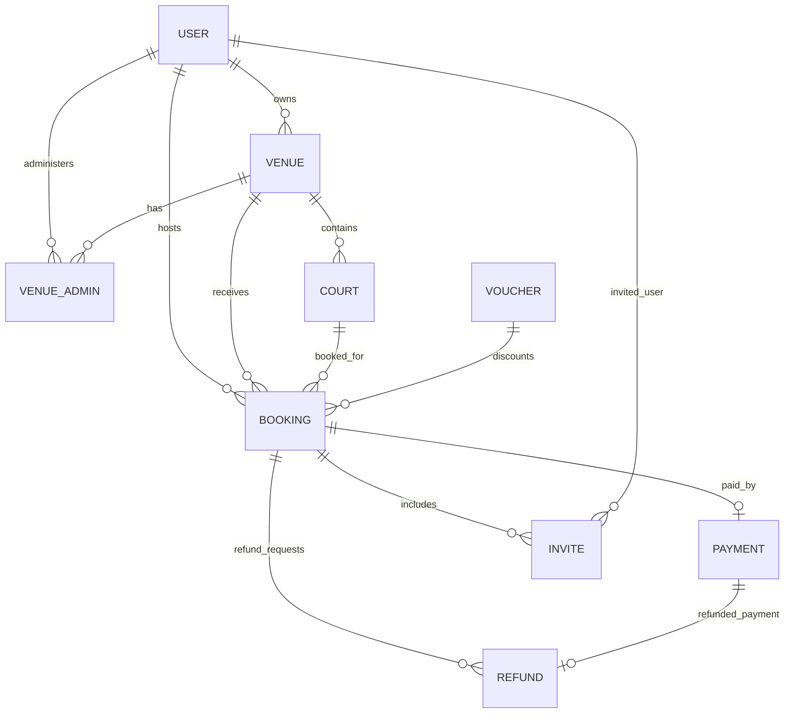

# Padelhive Backend ERD

## Relationship summary

- Users own venues, administer venues via VenueAdmin, host bookings, and receive invites.
- Venues contain courts and receive bookings.
- Courts are booked via bookings.
- Bookings can reference a voucher, have one payment, and multiple invites/refunds.
- Payments may have an optional refund record.
